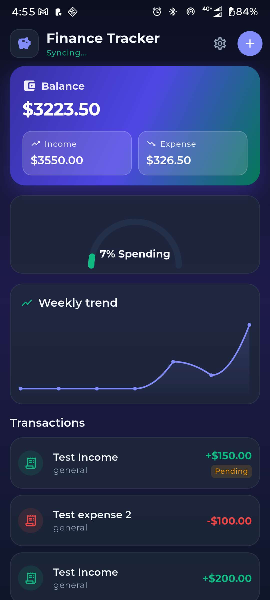
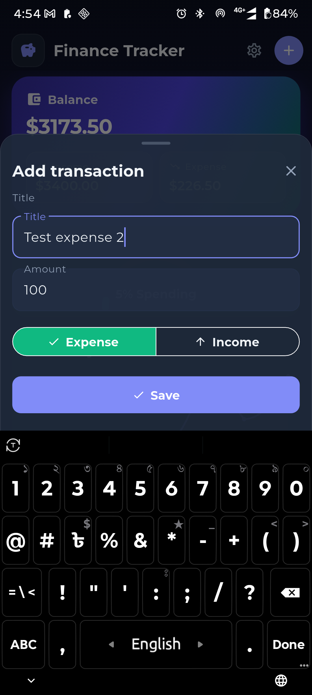
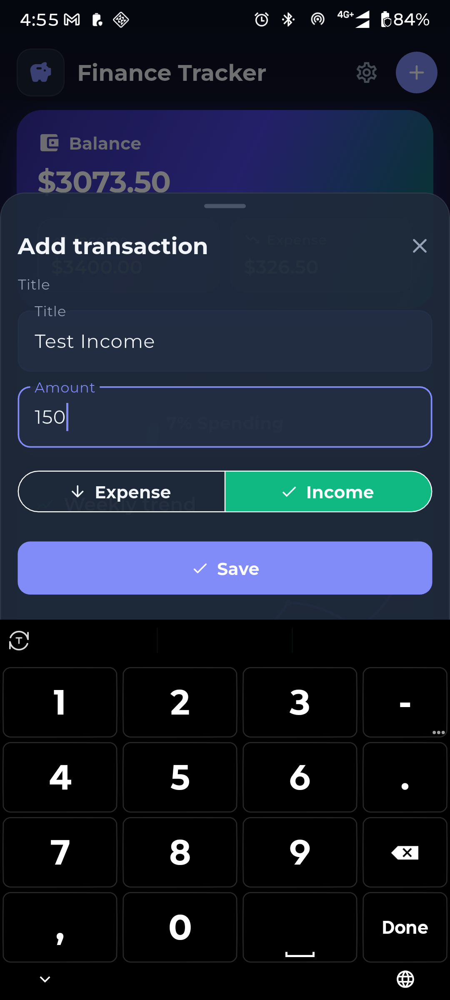
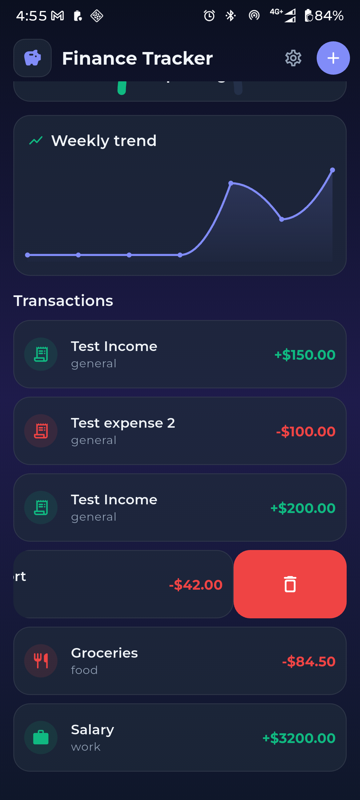

# SpendArc

**Taghyeer Technologies — Senior Flutter Developer (online assessment)**

Personal finance tracker delivered as one cohesive Flutter app. The repo also ships a small multi-flavor boilerplate around the demo (`package: riverpod_boilerplate`).

**Stack:** `flutter_bloc` · `get_it` · `go_router` · `dio` · **Dart** `^3.10.1`

### Assessment coverage

| Module | Weight | Implemented in |
|--------|--------|----------------|
| Clean architecture — layers, `get_it`, `Either<Failure,T>`, use cases | 20% | `features/finance_tracker/domain`, `*_di.dart`, `service_locator.dart` |
| Custom animations — arc meter, line chart, spring swipe delete, particle burst | 35% | `presentation/animations/` |
| BLoC — optimistic updates, rollback, `SyncBloc` ↔ `FinanceBloc`, disposal | 20% | `finance_bloc.dart`, `sync_bloc.dart` |
| Offline-first — local load, write queue, background sync, JSON isolate | 15% | `finance_local_datasource.dart`, `finance_write_queue.dart`, `finance_sync_service.dart` |
| Testing — 5+ unit, 2 widget, all pass | 10% | `test/features/finance_tracker/`, `flutter test` |

**Bonus (optional):** adaptive layout · GLSL shaders · GoRouter deep links — not included.

## Screenshots

<p align="center">
  
</p>
<p align="center"><em>Dashboard — balance, arc meter, weekly chart, transactions</em></p>

<p align="center">
  
  &nbsp;&nbsp;
  
</p>
<p align="center"><em>Add transaction — expense and income</em></p>

<p align="center">
  
</p>
<p align="center"><em>Swipe to delete transaction</em></p>

---

## Quick start

```bash
flutter pub get
flutter analyze
flutter test
flutter run --flavor dev -t lib/flavors/main_dev.dart
```

---

## What’s in the app

| Feature | Location | Notes |
|---------|----------|--------|
| **SpendArc** | `lib/features/finance_tracker/` | Local-first finance dashboard (main demo) |
| **Settings** | `lib/features/settings/` | Theme, locale (EN/BN), haptics |
| **Splash** | `lib/features/splash/` | Splash → home |
| **sample_api** | `lib/features/sample_api/` | Small Dio + Cubit example (no UI) |

SpendArc includes: balance card, arc meter, line chart, transaction list (swipe delete), add-transaction sheet, offline queue + sync, optimistic add with rollback.

---

## Architecture (review map)

Layers per feature: **domain → data → presentation**, wired in `<feature>_di.dart`.

| Layer | Folder | Review for |
|-------|--------|------------|
| Domain | `domain/entities`, `repositories`, `usecases` | No Flutter/Dio imports; `Either<Failure, T>` from use cases |
| Data | `data/datasources`, `models`, `repositories` | API/storage only; map to entities; `ErrorHandler.mapToFailure` |
| Presentation | `presentation/bloc`, `pages`, `widgets` | UI + state; no direct HTTP |

**App wiring**

| File | Role |
|------|------|
| `lib/flavors/main_*.dart` | Entry → `bootstrap()` |
| `lib/app/bootstrap.dart` | Flavor, storage, migrations, DI, `runApp` |
| `lib/shared/di/app_dependencies.dart` | Dio, storage, connectivity, haptics |
| `lib/shared/di/service_locator.dart` | `get_it` — registers `FinanceBundle` |
| `lib/app/app_scope.dart` | Root `MultiBlocProvider` + `AppDependencies` |
| `lib/core/routing/app_router.dart` | `/` splash → `/home` |

**Finance blocs:** `FinanceBloc` (dashboard, transactions, optimistic add/delete) listens to `SyncBloc` (background sync). Subscriptions are cancelled in `close()`.

**Routing:** Home embeds the finance dashboard. Settings and add-transaction open as **bottom sheets**, not separate routes.

---

## Project layout

```text
lib/
├── app/                 # bootstrap, app.dart, app_scope
├── config/              # Environment, FlavorConfig
├── core/                # network, storage, theme, routing, shared widgets
├── features/
│   ├── finance_tracker/ # SpendArc (see finance_tracker_di.dart)
│   ├── home/
│   ├── sample_api/
│   ├── settings/
│   └── splash/
├── flavors/             # main_dev | main_staging | main_prod
└── shared/di/

l10n/en.json, l10n/bn.json
test/features/finance_tracker/   # unit + widget tests
```

---

## SpendArc data flow (short)

1. **Read:** `FinanceLocalDataSource` → repository → `GetFinanceDashboard` / `WatchTransactions`.
2. **Write:** local save → `FinanceWriteQueue` → `FinanceSyncService` when online.
3. **UI:** `FinanceBloc` shows cached data immediately; failed optimistic writes show a rollback snackbar.

Key files for reviewers:

- `finance_repository_impl.dart` — local + remote + queue
- `finance_sync_service.dart` — replay + merge
- `finance_bloc.dart` / `sync_bloc.dart` — state + inter-bloc events
- `presentation/animations/` — custom painters (arc, chart, swipe, particles)

---

## Flavors

Always pass **both** `--flavor` and `-t`:

```bash
flutter run --flavor dev -t lib/flavors/main_dev.dart
flutter run --flavor staging -t lib/flavors/main_staging.dart
flutter run --flavor prod -t lib/flavors/main_prod.dart
```

| Flavor | Entry | Base URL config |
|--------|--------|-----------------|
| `dev` | `lib/flavors/main_dev.dart` | `lib/core/constants/flavor_constants.dart` |
| `staging` | `lib/flavors/main_staging.dart` | same |
| `prod` | `lib/flavors/main_prod.dart` | same |

API paths: `lib/core/constants/api_constants.dart`. Override base URL: `--dart-define=BASE_URL=...`.

**Android:** product flavors in `android/app/build.gradle.kts`.  
**iOS:** schemes `dev` / `staging` / `prod` + `ios/Flutter/*.xcconfig`.

---

## Add a new feature

Copy `features/sample_api/` (remote-only) or `features/finance_tracker/` (local + sync).

```text
features/<name>/
├── domain/
├── data/
├── presentation/
└── <name>_di.dart
```

1. Domain — entity, repository interface, `UseCase` + `Either`.
2. Data — datasource(s), models, `*RepositoryImpl`.
3. Presentation — `Bloc`/`Cubit` + UI.
4. Register DI in `service_locator.dart` / `app_scope.dart`.
5. Route in `app_router.dart` or open via sheet/tab.

---

## Tests

| File | What it checks |
|------|----------------|
| `test/features/finance_tracker/domain/` | Use cases |
| `test/features/finance_tracker/data/` | Repository + local seed |
| `test/features/finance_tracker/presentation/finance_bloc_test.dart` | Refresh + optimistic rollback |
| `test/features/finance_tracker/widget/` | `BalanceCard`, `AddTransactionSheet` |
| `test/widget_test.dart` | Seeded repository → balance UI |

Helpers: `test/features/finance_tracker/finance_test_helpers.dart`, `mocks/mock_finance_repository.dart`.

Widget tests avoid pumping the full dashboard (animations + `pumpAndSettle` timeouts). `FinanceDashboardPage(autoStart: false)` is available when you need manual bloc control in tests.

---

## Common commands

```bash
# Android
flutter build apk --flavor dev -t lib/flavors/main_dev.dart
flutter build appbundle --flavor prod -t lib/flavors/main_prod.dart

# iOS
flutter build ios --simulator --debug --flavor dev -t lib/flavors/main_dev.dart
```

After dependency changes: commit `pubspec.lock`; on iOS run `cd ios && pod install`.

---

## Not in scope

- Auth screens (secure storage + session clear on 401 only)
- Deep links for `/finance/add` (redirects to home; sheets used instead)

