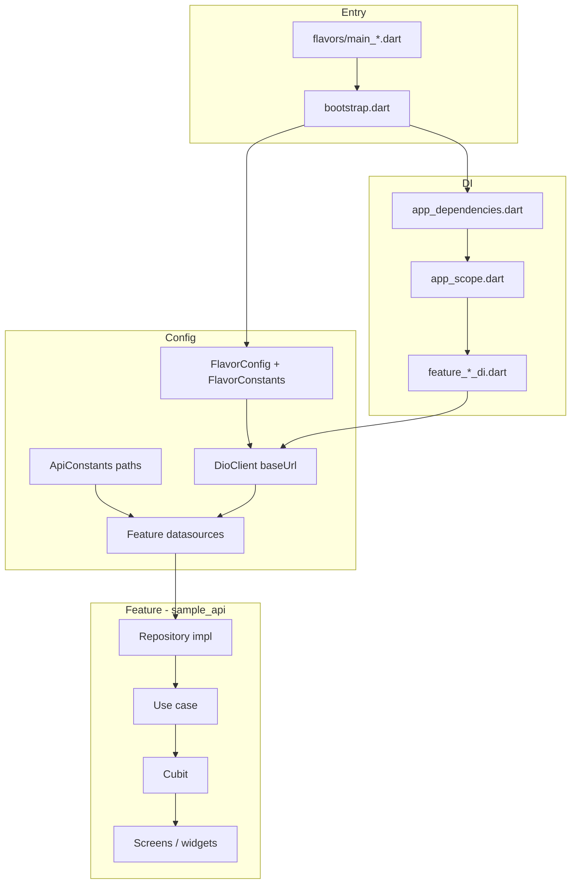

# BLoC Boilerplate

Flutter boilerplate with:

- Flavors (`dev`, `staging`, `prod`)
- flutter_bloc state management + app/feature DI via Cubits and `AppDependencies`
- GoRouter navigation
- Dio network layer + interceptors
- Clean architecture per feature (data / domain / presentation)
- Error mapping (`Exception` → domain `Failure`)
- Localization (`easy_localization`)
- Theme + glass UI helpers + micro-interactions

---

## Tech Stack

- `flutter_bloc`
- `go_router`
- `dio`
- `easy_localization`
- `shared_preferences`
- `flutter_secure_storage`
- `connectivity_plus`
- `package_info_plus`

---

## Architecture



| Layer | Responsibility |
|-------|----------------|
| **Entry** | `lib/flavors/main_<flavor>.dart` calls `bootstrap(Environment.*)` |
| **Config** | `FlavorConstants` = base URLs; `ApiConstants` = paths; `FlavorConfig` = runtime config |
| **App DI** | `lib/shared/di/app_dependencies.dart` — core services (`DioClient`, `BaseApiService`, storage, connectivity, haptics) |
| **App scope** | `lib/app/app_scope.dart` — `RepositoryProvider` + root `MultiBlocProvider` (theme, locale, home nav, sample API) |
| **Feature DI** | `lib/features/<name>/<name>_di.dart` — datasource → repository → use case → cubit factory |
| **Data** | Datasources call `BaseApiService`; models map to domain entities |
| **Domain** | Entities, repository interfaces, use cases (no Flutter imports) |
| **Presentation** | Cubits + UI; repositories map errors with `ErrorHandler.mapToFailure` |

**Startup order** (`bootstrap.dart`): `FlavorConfig` → `AppLog` → system UI → `EasyLocalization` → storage + **migrations** → `AppDependencies.create` → `AppScope.wrap` → `runApp`.

**Routing**: `appRouter` in `core/routing/app_router.dart` — splash → home shell (settings tab inside home).

---

## Project Structure

```text
lib/
├── main.dart                    # default entry (dev); flavors use main_<flavor>.dart
├── flavors/
│   ├── main_dev.dart
│   ├── main_staging.dart
│   └── main_prod.dart
├── app/
│   ├── app.dart
│   ├── app_scope.dart
│   └── bootstrap.dart
├── config/
│   ├── app_config.dart
│   ├── environment.dart
│   └── flavor_config.dart
├── core/
│   ├── constants/
│   │   ├── api_constants.dart       # HTTP paths / full URLs
│   │   ├── flavor_constants.dart    # base URLs + app names per flavor
│   │   └── route_constants.dart
│   ├── errors/
│   │   ├── error_handler.dart
│   │   ├── exceptions.dart
│   │   └── failures.dart
│   ├── localization/
│   │   ├── locale_cubit.dart
│   │   └── supported_locales.dart
│   ├── logging/
│   │   ├── app_log.dart
│   │   └── log_config.dart
│   ├── network/
│   │   ├── dio_client.dart
│   │   ├── base_api_service.dart
│   │   ├── api_map_utils.dart       # ApiResponseParser, coerceJsonMap, DioExtras
│   │   └── interceptors/
│   ├── routing/
│   │   └── app_router.dart
│   ├── services/
│   │   ├── connectivity_service.dart
│   │   ├── haptic_service.dart
│   │   └── micro_interaction_service.dart
│   ├── storage/
│   │   ├── storage_keys.dart
│   │   ├── local_storage_service.dart
│   │   ├── secure_storage_service.dart
│   │   └── migration/
│   │       ├── storage_migration.dart
│   │       └── storage_migrations_registry.dart
│   ├── system/
│   │   └── system_ui_config.dart
│   ├── theme/
│   │   ├── app_colors.dart
│   │   ├── app_theme.dart
│   │   ├── spacing.dart
│   │   ├── text_theme.dart
│   │   └── theme_cubit.dart
│   └── widgets/
│       └── ...
├── features/
│   ├── home/
│   │   └── presentation/ ...
│   ├── sample_api/                  # reference clean-arch feature
│   │   ├── data/
│   │   ├── domain/
│   │   ├── presentation/
│   │   └── sample_api_di.dart
│   ├── settings/
│   │   └── presentation/screens/
│   └── splash/
│       └── presentation/screens/
└── shared/
    ├── models/
    │   ├── base_response_model.dart
    │   └── base_response_sample.dart
    └── providers/
    └── di/
        └── app_dependencies.dart    # app-level service DI

l10n/
├── en.json
└── bn.json
```

---

## Flavors (`dev`, `staging`, `prod`)

Three environments share one codebase. **Always pass both** `--flavor` (native) and `-t` (Dart entry point).

| Flavor | Dart entry | Android application ID | iOS bundle ID |
|--------|------------|------------------------|---------------|
| `dev` | `lib/flavors/main_dev.dart` | `com.thesua7.riverpod_boilerplate.dev` | `com.thesua7.riverpodBoilerplate.dev` |
| `staging` | `lib/flavors/main_staging.dart` | `…riverpod_boilerplate.staging` | `…riverpodBoilerplate.staging` |
| `prod` | `lib/flavors/main_prod.dart` | `com.thesua7.riverpod_boilerplate` | `com.thesua7.riverpodBoilerplate` |

| Constant file | What to put there |
|---------------|-------------------|
| `flavor_constants.dart` | **Base URL** per environment (`https://dev-api…`, `https://api…`) |
| `api_constants.dart` | **Paths** (`/auth/login`) and third-party **full URLs** (DummyJSON sample) |

`FlavorConfig` reads `FlavorConstants.baseUrls` and supports `--dart-define=BASE_URL=...` override.

### Android

Product flavors in `android/app/build.gradle.kts` (`dev`, `staging`, `prod`) combine with `debug`, `profile`, and `release` build types.

Network permissions (`INTERNET`, `ACCESS_NETWORK_STATE`) are in `android/app/src/main/AndroidManifest.xml` so **release** builds include them.

### iOS

- **Schemes:** `dev`, `staging`, `prod` (`Debug-<flavor>`, `Profile-<flavor>`, `Release-<flavor>`).
- **xcconfig:** `ios/Flutter/dev.xcconfig`, `staging.xcconfig`, `prod.xcconfig`.

---

## Run Commands

```bash
flutter run --flavor <flavor> -t lib/flavors/main_<flavor>.dart
flutter run --profile --flavor <flavor> -t lib/flavors/main_<flavor>.dart
flutter run --release --flavor <flavor> -t lib/flavors/main_<flavor>.dart
```

**Examples**

```bash
flutter run --flavor dev -t lib/flavors/main_dev.dart
flutter run --flavor staging -t lib/flavors/main_staging.dart
flutter run --flavor prod -t lib/flavors/main_prod.dart
```

---

## Build Commands

### Android

```bash
flutter build apk --flavor <flavor> -t lib/flavors/main_<flavor>.dart
flutter build appbundle --flavor prod -t lib/flavors/main_prod.dart
```

### iOS

```bash
flutter build ios --simulator --debug --flavor dev -t lib/flavors/main_dev.dart
flutter build ios --release --flavor prod -t lib/flavors/main_prod.dart
```

> Configure distribution signing before shipping release builds.

---

## Dependency Injection (flutter_bloc)

| File | Scope |
|------|--------|
| `shared/di/app_dependencies.dart` | App-wide: storage, `DioClient`, `BaseApiService`, connectivity, haptics |
| `app/app_scope.dart` | Root `RepositoryProvider<AppDependencies>` + `MultiBlocProvider` for global cubits |
| `features/<name>/<name>_di.dart` | Feature: datasource → repository → use case → cubit factory |

`bootstrap.dart` creates `LocalStorageService` and `SecureStorageService`, builds `AppDependencies`, then wraps the app with `AppScope.wrap`.

Feature DI receives `BaseApiService` from `AppDependencies` (see `sample_api_di.dart`).

---

## How to Add a New Feature

```text
features/<feature_name>/
├── data/
│   ├── datasources/
│   ├── models/
│   └── repositories/
├── domain/
│   ├── entities/
│   ├── repositories/
│   └── usecases/
├── presentation/
│   ├── providers/
│   ├── screens/
│   └── widgets/
└── <feature_name>_di.dart
```

1. **Domain** — entity, repository interface, use case(s).
2. **Constants** — add paths to `api_constants.dart` (relative paths for your API; full URL only for external services).
3. **Data** — datasource uses `BaseApiService` + `ApiConstants`; model → entity mapping in repository impl.
4. **Errors** — `ErrorHandler.mapToFailure(error)` in repository `catch`.
5. **Presentation** — state class + `Cubit` (or `Bloc` with events); register in `app_scope.dart` or a feature-scoped `BlocProvider`.
6. **DI** — factory in `<feature>_di.dart`; pass `dependencies.apiService` from `AppDependencies`.
7. **UI** — route in `app_router.dart` or embed in an existing screen/tab.

---

## Constants

| File | Purpose |
|------|---------|
| `core/constants/flavor_constants.dart` | API **base URLs** + app display names per `Environment` |
| `core/constants/api_constants.dart` | HTTP **paths** and external **full URLs** |
| `core/constants/route_constants.dart` | GoRouter paths |
| `core/storage/storage_keys.dart` | SharedPreferences / secure-storage keys + `storageSchemaVersion` |

---

## Network + Base Response Pattern

- **`BaseApiService`** — HTTP verbs; maps bad responses to `ServerException`.
- **Relative paths** — resolved against `FlavorConfig.config.baseUrl` on `DioClient`.
- **Absolute URLs** — skip flavor base URL (sample: `ApiConstants.sampleProductDetail`).
- **Envelope APIs** `{ success, message, data }`:

```dart
final response = await _apiService.get<Map<String, dynamic>>(
  ApiConstants.productById(1),
);
return ApiResponseParser.parseOrThrow(
  response,
  dataParser: (raw) => MyModel.fromJson(coerceJsonMap(raw)),
);
```

- **Flat JSON** (e.g. DummyJSON) — `coerceJsonMap(response.data)` + model `fromJson` in datasource (see `sample_api`).
- **`api_map_utils.dart`** — `ApiResponseParser`, `coerceJsonMap`, `DioExtras`.
- **Interceptors** (order): `LoggingInterceptor` → `AuthInterceptor` → `RetryInterceptor` → `ConnectivityInterceptor`.
- **Logging** — `AppLog.initialize(LogConfig(...))` in `bootstrap.dart`, `enabled: kDebugMode`. `AppLog.netDump` chunks large JSON so the console does not truncate with `<…>`.
- **Session** — `401` and unauthorized API envelopes call `clearSession` via `onSessionExpired` / `onUnauthorized`.

**Data flow:** `Datasource → (Parser/Model) → Repository → Entity → Use case → Notifier → UI`

---

## Home Tab Sample Orchestration

- Data from `SampleApiCubit` (`sample_api` feature).
- Auto-load in `HomeScreen`: first frame + when returning to Home tab (`homeNavProvider`).
- Tests: `HomeScreen(enableAutoLoad: false)`.

---

## Storage

- **`SecureStorageService`** — `accessToken`, `refreshToken`, `sessionId` (`StorageKeys`).
- **`LocalStorageService`** — theme, locale, schema version.
- **Migrations** — `StorageMigrationRunner` in `bootstrap.dart`; register in `core/storage/migration/storage_migrations_registry.dart` (append only, never reorder).

---

## Localization

- Files in `l10n/` (`en.json`, `bn.json`) — English and Bangla only.
- UI: `"key".tr()`.

---

## Theme and UI

- `core/theme/` — `AppTheme`, `themeModeProvider`.
- Widgets: `GradientBody`, `GlassBackground`, `AnimatedTap`, `AppButton`, etc.
- `HapticService`, `MicroInteractionService` from `AppDependencies` via `context.read<AppDependencies>()`.

---

## Quality Commands

```bash
flutter pub get
flutter analyze
flutter test
```

**Lock files:** Commit `pubspec.lock` and `ios/Podfile.lock` (they are not gitignored). After dependency changes, run `flutter pub get` and `cd ios && pod install`, then commit updated locks.

Baseline: `flutter analyze` — no issues; `flutter test` — passing.

---

## Architecture checklist (final)

| Item | Status |
|------|--------|
| Flavor entry points + `FlavorConfig` | OK |
| Base URL vs path split (`flavor_constants` / `api_constants`) | OK |
| App DI (`app_dependencies.dart`) + feature DI (`*_di.dart`) | OK |
| Network: Dio + interceptors + `BaseApiService` | OK |
| Repository error mapping | OK |
| Storage migrations at bootstrap | OK |
| Sample feature demonstrates full stack | OK |
| Auth logout / login route | Not included (session clear only; add when you add auth feature) |
